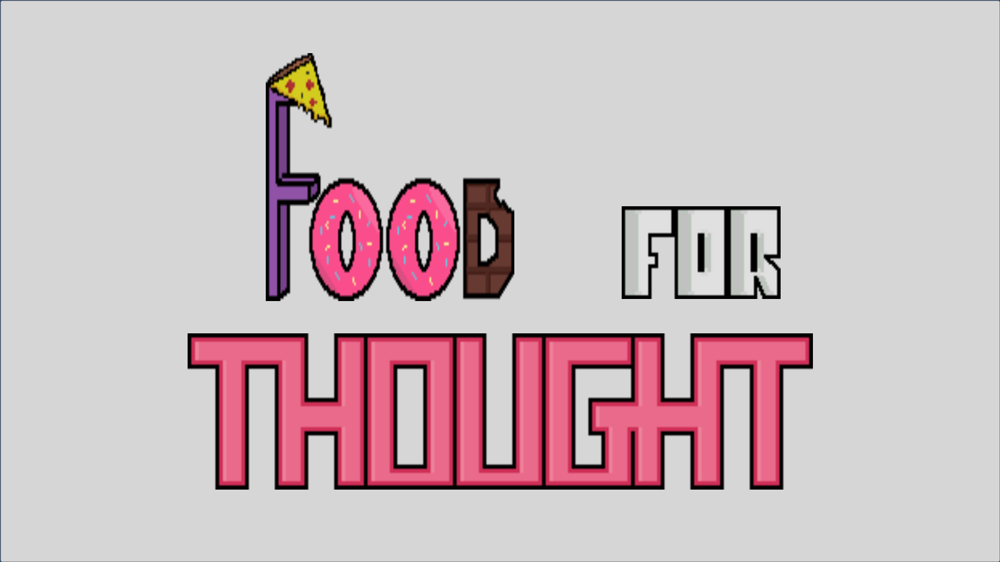
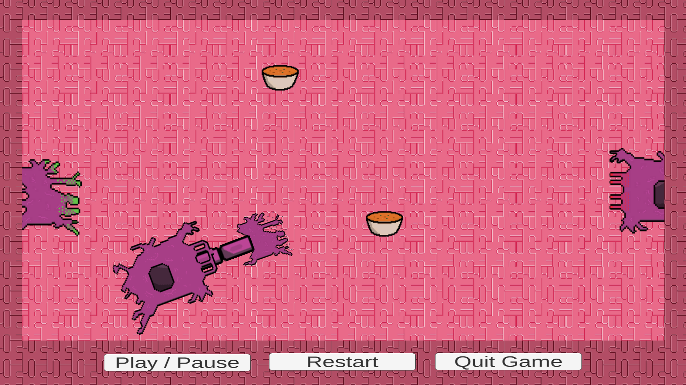
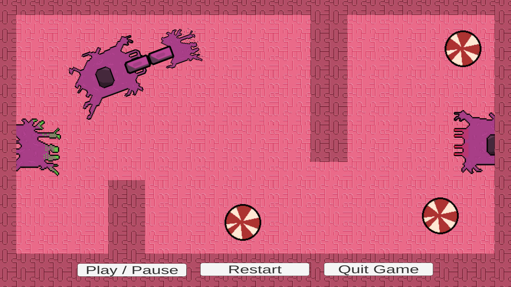
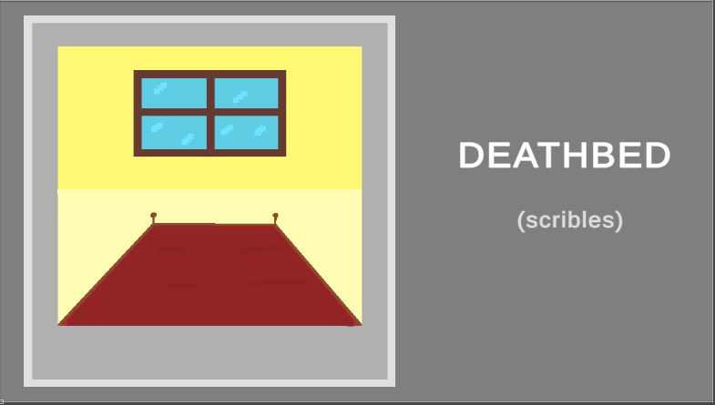

# GGJ2023
Global Game Jam 2023 in IST - Tagus Park

# Unity Version
2021.3.20f1

# LINK TO PLAY
https://rubenftgd.github.io/GGJ2023/

# CONTROLS
**LEFT MOUSE** - Click and Drag -> Food and Dendrites

**MOUSE WHEEL** - Rotate -> Dendrites

---

**Game Intro Name**
======
 

---

**Image Gameplay - Level 1**
======
 

---

**Image Gameplay - Level 2**
======
 

---

**Image Gameplay - Marriage**
======

---

**Image Gameplay - History**
======
 

---

# TO FIX WEB GAME DEPLOY
Go to Player setting -> WebGL -> Publish settings -> Compression = disabled. 